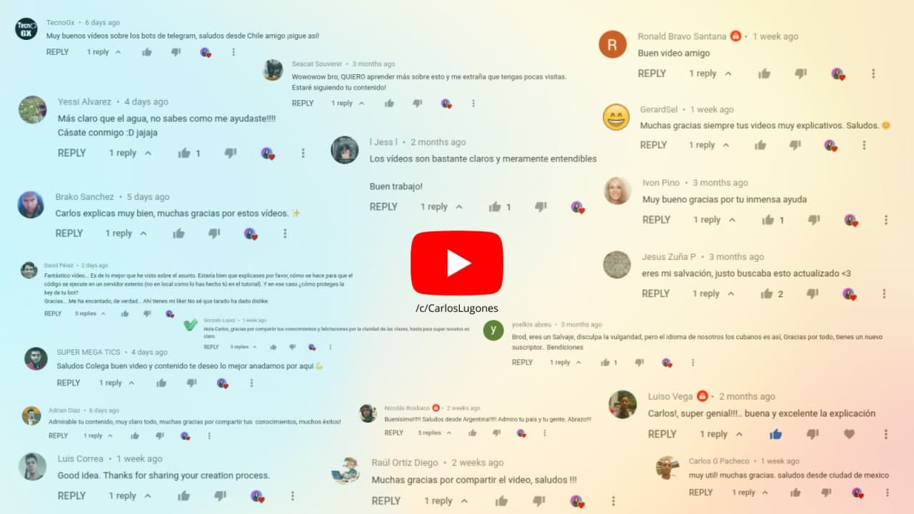

# lugodev-example-bot

En esta serie de vídeos explico cómo crear un bot de Telegram, desde la idea, el desarrollo, hasta la puesta en producción.

Todo comenzó [en este hilo de Twitter](https://twitter.com/i/status/1311765358387187712).

## Lecciones:
- [Lección 1: Introducción](https://youtu.be/yEtsoxkxF_0)
- [Lección 2: Bot para generar códigos QR](https://youtu.be/aIJtcTZRds8)
- [Lección 3: Añadir botones a tu bot](https://youtu.be/DBoWGTO4TaU)
- [Lección 4: Acortar enlaces usando API externa](https://youtu.be/i6TRgJz_mac)
- [Lección 5: Cargar token desde una variable de entorno](https://youtu.be/LV4C83bloU8)
- [Lección 6: Reenviar mensajes de un grupo a un canal](https://youtu.be/nQy5B19R8Uw)

## Documentación sobre bots de Telegram:
- [Bots](https://core.telegram.org/bots)
- [API](https://core.telegram.org/api)
- [python-telegram-bot](https://python-telegram-bot.readthedocs.io/en/stable)

## Entorno de desarrollo:
- [Python](https://www.python.org/downloads)
- [PyCharm](https://www.jetbrains.com/es-es/pycharm/download)
- [python-telegram-bot](https://python-telegram-bot.org)

## Stay tuned!

- [Únete a mi canal de Telegram](https://t.me/lugodev)
- [Conecta conmigo](https://lugodev.com)

## Apoya mi trabajo

